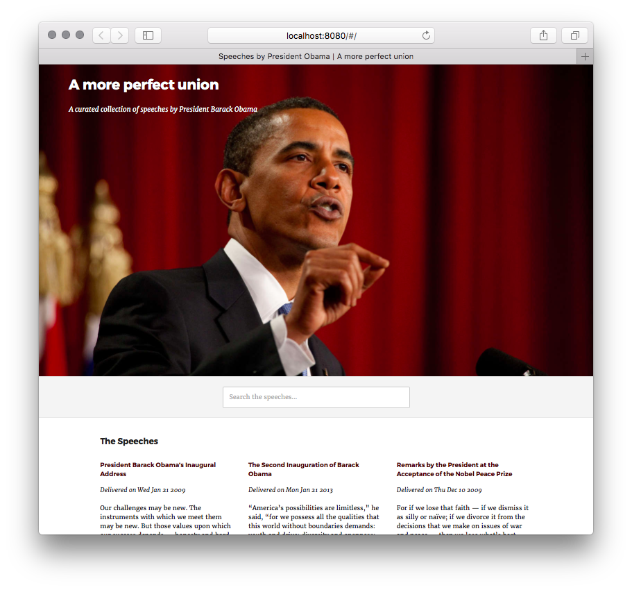
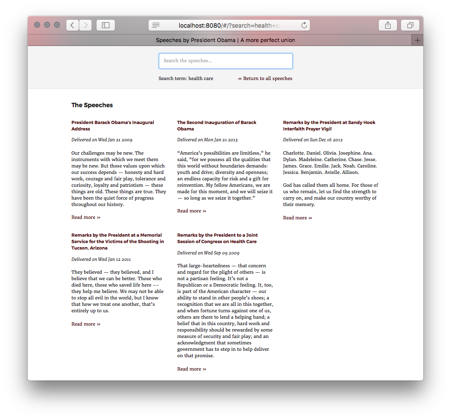
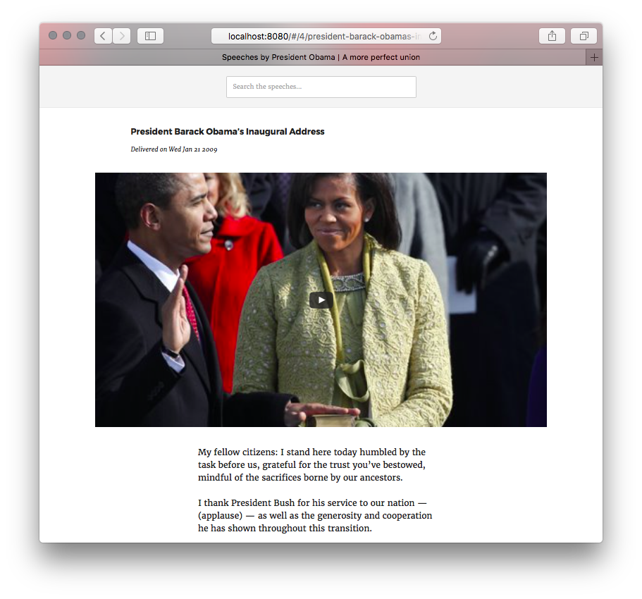
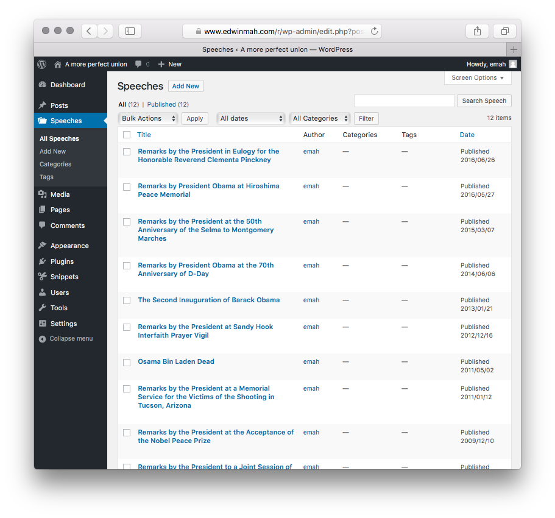

# A more perfect union: A curated collection of speeches by President Obama

## Summary

President Obama is one of the finest public speakers and writers of this generation. This site allows users to search and view a curated collection of speeches representing some of his best work, where he inspired us and crafted deft arguments for making our union more perfect.

## Technology used

This site was created with [React](https://facebook.github.io/react/) and the [WordPress REST API](http://v2.wp-api.org/). The primary advantage of using React with the WordPress REST API is that the site, a single-page application, does not have to query the WordPress database each time a page is loaded. As a result, the site will respond more quickly to user interaction.

Other software used to create this site include [Redux](http://redux.js.org/), [React Router](https://github.com/ReactTraining/react-router), [Thunk](https://github.com/gaearon/redux-thunk), [Webpack](http://webpack.github.io/docs/), [Mocha](https://mochajs.org/), and [Chai](http://chaijs.com/).

## WordPress setup

Before creating the React front-end theme, it's necessary to perform a [standard WordPress installation](https://codex.wordpress.org/Installing_WordPress) and install and activate the [WordPress REST API plugin](https://wordpress.org/plugins/rest-api/).

If you plan on having content that is not one of the standard WordPress post types (e.g., post, page, attachment, revision), you can create a [custom content type](https://codex.wordpress.org/Function_Reference/register_post_type).

There are several [custom content type WordPress plugins](https://wordpress.org/plugins/search.php?q=custom+post+type) available that allow you to create custom content types from the WordPress dashboard. Alternatively, you could [create a WordPress plugin](https://codex.wordpress.org/Writing_a_Plugin) using the `register_post_type` WordPress function.

A good resource for WordPress development is [GenerateWP](https://generatewp.com), which is an online tool that will generate the necessary code for most WordPress functions. In addition, a good plugin to manage custom plugin code is [Code Snippets](https://wordpress.org/plugins/code-snippets/), which provides an easy way to add plugin functions without creating your own actual plugins.

For this site, I used to the following function to create a "Speeches" custom content type:

	// Register Custom Post Type
	function emah_cpt_speeches() {
	
	  $labels = array(
	    'name'                  => _x( 'Speeches', 'Post Type General Name', 'text_domain' ),
	    'singular_name'         => _x( 'Speech', 'Post Type Singular Name', 'text_domain' ),
	    'menu_name'             => __( 'Speeches', 'text_domain' ),
	    'name_admin_bar'        => __( 'Speeches', 'text_domain' ),
	    'archives'              => __( 'Speeches Archive', 'text_domain' ),
	    'parent_item_colon'     => __( 'Parent Item:', 'text_domain' ),
	    'all_items'             => __( 'All Speeches', 'text_domain' ),
	    'add_new_item'          => __( 'Add New Speech', 'text_domain' ),
	    'add_new'               => __( 'Add New', 'text_domain' ),
	    'new_item'              => __( 'New Speech', 'text_domain' ),
	    'edit_item'             => __( 'Edit Speech', 'text_domain' ),
	    'update_item'           => __( 'Update Speech', 'text_domain' ),
	    'view_item'             => __( 'View Speech', 'text_domain' ),
	    'search_items'          => __( 'Search Speech', 'text_domain' ),
	    'not_found'             => __( 'Not found', 'text_domain' ),
	    'not_found_in_trash'    => __( 'Not found in Trash', 'text_domain' ),
	    'featured_image'        => __( 'Featured Image', 'text_domain' ),
	    'set_featured_image'    => __( 'Set featured image', 'text_domain' ),
	    'remove_featured_image' => __( 'Remove featured image', 'text_domain' ),
	    'use_featured_image'    => __( 'Use as featured image', 'text_domain' ),
	    'insert_into_item'      => __( 'Insert into speech', 'text_domain' ),
	    'uploaded_to_this_item' => __( 'Uploaded to this speech', 'text_domain' ),
	    'items_list'            => __( 'Speeches list', 'text_domain' ),
	    'items_list_navigation' => __( 'Speeches list navigation', 'text_domain' ),
	    'filter_items_list'     => __( 'Filter speeches list', 'text_domain' ),
	  );
	  $args = array(
	    'label'                 => __( 'Speeches', 'text_domain' ),
	    'description'           => __( 'Speech Items', 'text_domain' ),
	    'labels'                => $labels,
	    'supports'              => array( 'title', 'editor', 'excerpt', 'author', 'thumbnail', 'custom-fields', 'post-formats', ),
	    'taxonomies'            => array( 'category', 'post_tag' ),
	    'hierarchical'          => false,
	    'public'                => true,
	    'show_ui'               => true,
	    'show_in_menu'          => true,
	    'menu_position'         => 5,
	    'menu_icon'             => 'dashicons-portfolio',
	    'show_in_admin_bar'     => true,
	    'show_in_nav_menus'     => true,
	    'show_in_rest'       	=> true,
	    'can_export'            => true,
	    'has_archive'           => true,    
	    'exclude_from_search'   => false,
	    'publicly_queryable'    => true,
	    'capability_type'       => 'post',
	  );
	  register_post_type( 'speeches', $args );
	
	}
	add_action( 'init', 'emah_cpt_speeches', 0 );

Make sure that the `show_in_rest` argument is set to `true` because this will make the custom content type available in the JSON API response.

If you want to add custom fields to the JSON response, follow the [instructions for modifying responses](http://v2.wp-api.org/extending/modifying/) in the WordPress REST API documentation and make note of the [`register_rest_field` example](http://v2.wp-api.org/extending/modifying/#how-to-use-registerrestfield).

For this site, I used the `register_rest_field` to add a "video" field for a YouTube link for each speech. Note that the code is not that different than the example provided in the API documentation.

	add_action( 'rest_api_init', 'slug_register_video' );
	function slug_register_video() {
	  register_rest_field( 'speeches',
		'video',
		array(
		  'get_callback'    => 'slug_get_video',
		  'update_callback' => null,
		  'schema'          => null,
		)
	  );
	}
	
	/**
	 * Get the value of the "video" field
	 *
	 * @param array $object Details of current post.
	 * @param string $field_name Name of field.
	 * @param WP_REST_Request $request Current request
	 *
	 * @return mixed
	 */
	function slug_get_video( $object, $field_name, $request ) {
	  return get_post_meta( $object[ 'id' ], $field_name, true );
	}

Now, create the content via the WordPress dashboard just as you would normally and build the React front-end.

## Screenshots

Fig. 1 – A more perfect union homepage

***

Fig. 2 – "Health Care" search results

***

Fig. 3 – Single speech page

***

Fig. 4 – Speeches custom content type in WordPress dashboard

